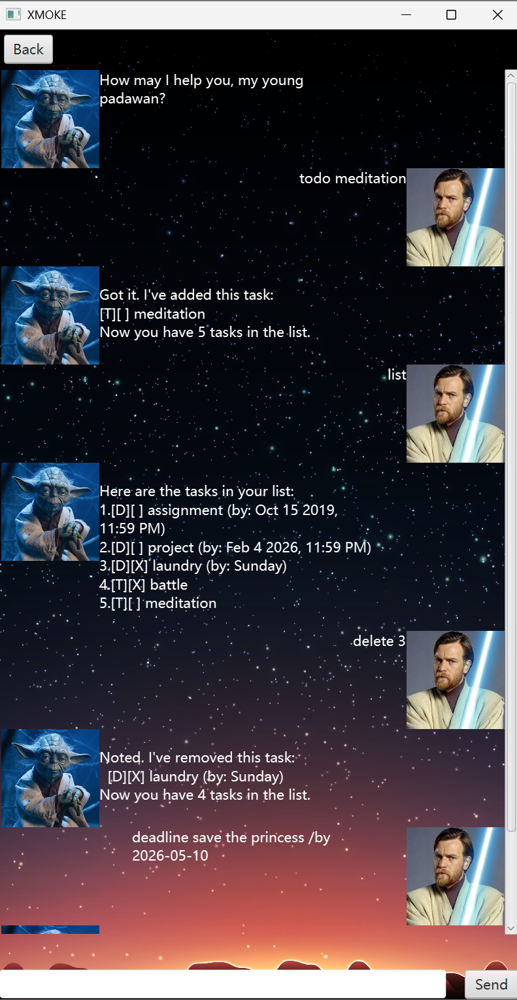

# XMOKE — Jedi Training Task Manager

> *"How may I help you, my young padawan?"*

**XMOKE** is a desktop task manager set in the world of **Star Wars**. It is used by Jedi Masters in training to report their duties and missions to **Master Yoda**, the oldest and wisest Jedi Master, who oversees all padawan training. The app is named after **XMOKE**, the legendary Jedi god of focus and discipline.

---

## The Story

In the Jedi Temple, every Master must keep track of their training tasks, missions, and deadlines. **Master Yoda** does not simply assign lessons, he expects each Jedi to *report* their own commitments so that the Force stays balanced and nothing falls through the cracks.

You take on the role of one of four Jedi Masters:

- **Obi-Wan Kenobi** — The wise general who watched over Anakin and later guided Luke.
- **Mace Windu** — Master of Vaapad and guardian of the Jedi Order’s highest ideals.
- **Qui-Gon Jinn** — The maverick who defied the Council and discovered the Chosen One.
- **Luke Skywalker** — The hope of the Rebellion and the last of the Jedi.

When you open the app, you choose which Master you are. You then enter the training chamber and speak with **Master Yoda**. He greets you with *"How may I help you, my young padawan?"* and keeps a record of everything you report: tasks, deadlines, events, and progress. Each Master has **their own separate record**—Obi-Wan’s tasks are not the same as Luke’s. When you ask for wisdom, Yoda may reply with a famous Jedi saying. When you are done, you bid him farewell and leave the chamber.

---

## Features

- **Jedi identity**: Choose your identity (Obi-Wan, Mace, Qui-Gon, or Luke) on the main page. Each has their own saved task list and profile.
- **Chat with Master Yoda**: A chat-style window where you type commands and Yoda replies. Your messages and his responses appear with profile pictures.
- **Report tasks to Yoda**: Add **todos**, **deadlines**, and **events**; list them, mark them done, unmark, delete, find by keyword, and sort by deadline. All of this is “reporting” your training log to Yoda.
- **Wisdom from the Force**: Type **cheer** to receive a random piece of Jedi wisdom (e.g. *"Do. Or do not. There is no try."*).
- **Persistence**: Your reported tasks are saved per Jedi and loaded the next time you open the app.
- **Leave the chamber**: Type **bye** to say goodbye to Yoda and close the app. Use **Back** to return to the main page and switch to another Jedi.

---

## How it looks

The screenshot below shows how the app works: the chat window where you talk to Master Yoda, send commands, and see his replies.



---

## What You Can Send to Master Yoda

These are the **commands** (messages) the app understands. You type them in the chat and press Enter (or click Send).

| What you want to do | What to type |
|---------------------|--------------|
| See all tasks you’ve reported | `list` |
| Add a simple task (todo) | `todo <description>` e.g. `todo Meditate at dawn` |
| Add a task with a due date/time | `deadline <description> /by <date time>` e.g. `deadline Finish report /by 2025-12-31 2359` or `deadline Report /by 31/12/2025` |
| Add an event with start and end | `event <description> /from <date time> /to <date time>` e.g. `event Council meeting /from 2025-06-01 0900 /to 2025-06-01 1100` |
| Mark a task as done | `mark <number>` e.g. `mark 1` (number = position in the list) |
| Mark a task as not done | `unmark <number>` e.g. `unmark 1` |
| Delete a task | `delete <number>` e.g. `delete 2` |
| Find tasks by keyword | `find <keyword>` e.g. `find meditation` |
| Sort tasks by deadline | `sort` (earliest first; tasks with no deadline go to the end) |
| Get a random Jedi wisdom quote | `cheer` |
| Say goodbye and close the app | `bye` |

**Date/time formats** (for `deadline` and `event`):  
`yyyy-MM-dd HHmm` (e.g. `2025-12-31 2359`) or `d/M/yyyy HHmm` (e.g. `31/12/2025 2359`). Date-only is allowed; time defaults to end of day.

If you type something Yoda doesn’t understand, he will tell you he doesn’t know that command.

See also the [User Guide](docs/README.md) for more details.

---

## Prerequisites

- [x] **JDK 21** installed
- [ ] Project opened in IntelliJ (or another IDE)

---

## Setting up in IntelliJ

1. Open IntelliJ (if you are not in the welcome screen, click **File** > **Close Project** to close the existing project first).
2. Open the project:
   - Click **Open**.
   - Select the project directory, then click **OK**.
   - Accept the defaults if prompted.
3. Configure the project to use **JDK 21**: [Set up JDK in IntelliJ](https://www.jetbrains.com/help/idea/sdk.html#set-up-jdk). Set **Project language level** to **SDK default**.
4. To run the app: run **MainApp** (in `src/main/java/MainApp.java`) — e.g. right-click `MainApp.java` and choose **Run 'MainApp.main()'**, or run the Gradle task **run** (e.g. `.\gradlew run`). A window titled **XMOKE** will open; choose your Jedi, click **Enter**, then chat with Master Yoda in the text box and press Enter or click **Send**.

> [!NOTE]
> Keep the `src/main/java` folder as the root for Java source files so that tools like Gradle can find them.

---

## Running the app (command line)

From the project root:

```bash
./gradlew run
```

On Windows:

```batch
gradlew.bat run
```

The GUI window will open. You can also build a runnable JAR:

```bash
./gradlew shadowJar
```

The JAR is created in `build/libs/`. Run it with:

```bash
java -jar build/libs/javafx-tutorial-duke.jar
```

---

## Running tests

Unit tests (JUnit 5):

```bash
./gradlew test
```

On Windows:

```batch
gradlew.bat test
```

---

## Tech

- Java 21, JavaFX 21 (GUI), Gradle. Main entry point: **MainApp**; GUI and FXML under `src/main/resources/view/`.
