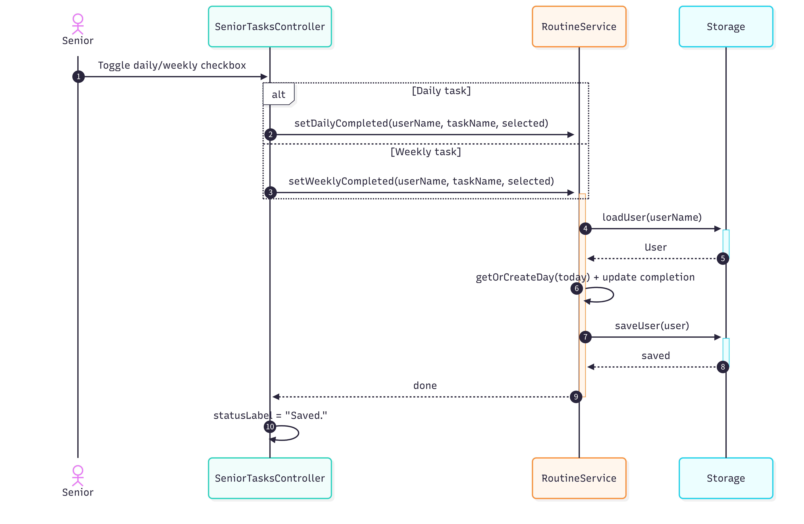

# Software Design Document (SDD)

## System Overview

The Healthcare App for Tracking Daily Activities for Seniors is a desktop GUI-based application designed to help seniors and caregivers manage recurring routines and record daily wellbeing logs.

The system allows users to:
- manage daily or weekly routines such as medication, hydration, supplements, or exercise
- record daily wellbeing logs in free-text form
- store records persistently for later review
- generate weekly or monthly summaries for caregivers or healthcare professionals

The system is intended for routine tracking and record-keeping purposes only. It does not provide medical diagnosis or treatment recommendations.

---

## Architecture Design

The system follows a modular layered architecture consisting of four main components:

- **UI**
- **Service**
- **Model**
- **Storage**

The introduction of the service layer separates application logic from the JavaFX controllers.  
Controllers are responsible for handling user interaction and scene navigation, while services process application logic and interact with storage and model objects.

### Component Interaction

1. The **UI** handles user interaction through a graphical interface.
2. Controllers receive user actions from the UI.
3. Controllers delegate application logic to the **Service** layer.
4. The **Service** layer reads or updates **Model** objects.
5. The **Service** layer uses **Storage** to persist data to local files.
6. The UI refreshes to reflect the updated state.

This structure improves separation of concerns, reduces coupling between UI and persistence logic, and makes the system easier to maintain and extend.

---

## Major System Components

### UI Component

The UI component is responsible for:
- displaying the graphical interface using JavaFX
- allowing users to interact with routines and daily logs
- presenting summaries and historical data
- forwarding user actions to controllers
- displaying feedback such as success messages or errors

Key UI views include:
- login view (user selection)
- senior task checklist view
- daily log input view
- caregiver menu view
- history view
- summary generation view

The UI is designed to be simple, readable, and suitable for senior users.

---
### Service Component

The Service component contains the application logic of the system.

It is responsible for:
- handling routine-related operations
- handling login and caregiver account operations
- handling daily log operations
- preparing history data for display
- generating summary reports

Key service classes include:

#### AuthService
- handles caregiver authentication
- retrieves senior user names
- adds new users
- updates caregiver password

#### RoutineService
- retrieves daily and weekly routines
- adds and removes routines
- retrieves the current day record
- updates task completion status

#### LogService
- loads today's daily log
- saves today's daily log

#### HistoryService
- prepares today's history view data
- prepares weekly history view data

#### SummaryService
- coordinates summary generation for a selected user
- delegates report generation to `SummaryGenerator`

---

### Model Component

The Model component represents the core data structures of the system.

It is responsible for:
- storing routines and their properties
- storing daily wellbeing logs
- maintaining user profile data
- organizing historical records

Key model classes include:

#### User
- represents a single user
- stores daily and weekly routines
- stores a list of day records
- provides methods to retrieve or create day data

#### Task
- represents a recurring routine
- contains description and routine type

#### TaskList
- manages a collection of tasks
- supports addition, removal, and lookup

#### Day
- represents a single day’s record
- contains:
  - date
  - log (free-text)
  - daily task completion status
  - weekly task completion status
- handles synchronization with routines

#### Enums
- Role (SENIOR, CAREGIVER)
- RoutineType (DAILY, WEEKLY)

---

### Storage Component

The Storage component handles persistent data storage using local files.

It is responsible for:
- saving and loading user profiles, routines, and logs
- organizing data into user-specific folders
- storing and validating caregiver credentials
- providing persistence support to the service layer

The storage structure is:

- data/ 
  - app/ 
    - caregiver.txt 
  - users/
    - senior1/ 
      - profile.txt 
      - dailyRoutines.txt 
      - weeklyRoutines.txt 
      - days/ 
        - YYYY-MM-DD.txt
    - senior2/
    - ...

Each day file stores:
- log text
- daily task completion
- weekly task completion

---

### Summary Component

The system includes a summary generation component.

#### SummaryGenerator
- generates monthly summary reports in CSV format
- computes:
  - completion rates
  - task statistics
  - daily logs
  - detailed history
- uses a rolling 30-day period 

---

## Data Flow

A typical system interaction follows this sequence:

1. The user performs an action in the GUI.
2. A controller receives the action.
3. The controller calls the appropriate service.
4. The service loads or updates the required model objects.
5. The service requests the storage component to persist the updated data.
6. The controller refreshes the UI to reflect the new state.

---

## UML Diagrams

### Use Case Diagram

---

### Class Diagram

---

### Sequence Diagrams

**Scenario**: Senior marking a routine as completed

1. The senior toggles a daily or weekly task checkbox in the UI.
2. The `SeniorTasksController` receives the action.
3. The controller determines whether the task is daily or weekly.
4. The controller calls `RoutineService`:
   - `setDailyCompleted(userName, taskName, selected)` for daily tasks, or
   - `setWeeklyCompleted(userName, taskName, selected)` for weekly tasks.
5. `RoutineService` calls `Storage.loadUser(userName)` to retrieve the user data.
6. The `User` object is returned to the service.
7. `RoutineService` retrieves or creates the current day using `getOrCreateDay(today)` and updates the task completion status.
8. `RoutineService` calls `Storage.saveUser(user)` to persist the updated data.
9. Control returns to the controller after saving is completed.
10. The UI updates to reflect the new state (e.g., displaying "Saved.").

---

## Key Design Decisions

### 1. Desktop GUI-based design

The system is implemented as a desktop GUI application to improve accessibility for seniors.

A graphical interface is easier to understand and interact with compared to command-line interfaces.

---

### 2. Layered architecture with service separation

The system uses UI, Service, Model, and Storage components.

Controllers handle user interaction and scene flow, while the service layer contains the application logic.  
This separates UI logic from persistence and data-processing logic, reducing coupling and improving maintainability.

The service layer also makes the code easier to extend, since new features can be added by updating service logic without overloading the controllers.

---

### 3. File-based storage

The system uses local file storage instead of a database.

Advantages:
- supports offline usage
- requires no setup
- easy to inspect and debug

---

### 4. Day-based data organization

Each day is stored as a separate record.

This allows:
- tracking historical data
- generating summaries
- preventing data overwrite

---

### 5. Immediate persistence

All updates are saved immediately after user actions.

This ensures:
- minimal data loss risk
- consistent system state

---

### 6. Free-text logging

Daily logs are stored as free-text entries.

This allows seniors to:
- record information naturally
- avoid complex input structures