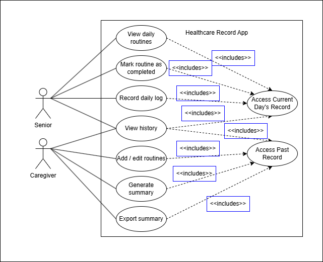
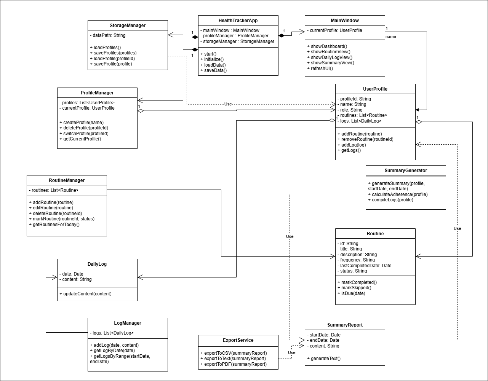
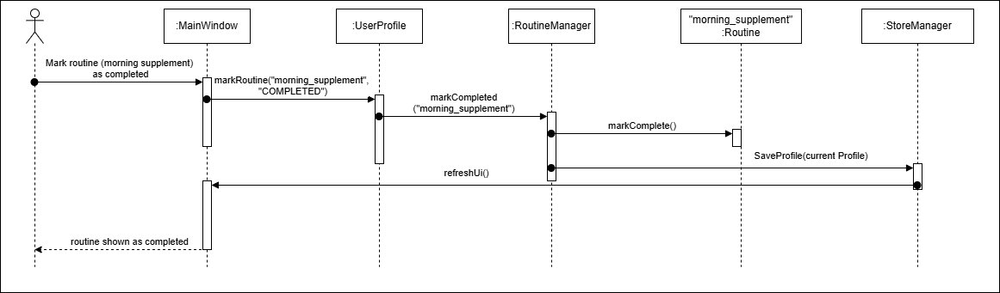

# Software Design Document (SDD)

## System Overview

The Healthcare App for Tracking Daily Activities for Seniors is a desktop GUI-based application designed to help seniors and caregivers manage recurring routines and record daily wellbeing logs.

The system allows users to:
- manage daily or weekly routines such as medication, hydration, supplements, or exercise
- record daily wellbeing logs in free-text form
- store records persistently for later review
- generate weekly or monthly summaries for caregivers or healthcare professionals

The system is intended for routine tracking and record-keeping purposes only. It does not provide medical diagnosis or treatment recommendations.

---

## Architecture Design

The system follows a modular layered architecture consisting of four main components:

- **UI**
- **Logic**
- **Model**
- **Storage**

This separation ensures that different parts of the system can be developed and maintained independently.

### Component Interaction

1. The **UI** handles user interaction through a graphical interface.
2. The **Logic** processes user actions and coordinates system behavior.
3. The **Model** stores and manages application data.
4. The **Storage** handles reading and writing data to local files.

This layered approach prevents direct coupling between UI and storage, improving maintainability.

---

## Major System Components

### UI Component

The UI component is responsible for:
- displaying the graphical interface using JavaFX
- allowing users to interact with routines and daily logs
- presenting summaries and historical data
- forwarding user actions to the Logic component
- displaying feedback such as success messages or errors

Typical UI views may include:
- dashboard view (overview of routines and recent logs)
- routine checklist view
- daily log input view
- history view
- summary/export view

The UI is designed to be simple, readable, and suitable for senior users.

---

### Logic Component

The Logic component acts as the central controller of the system.

It is responsible for:
- receiving user actions from the UI
- validating input data
- executing operations such as:
    - adding or modifying routines
    - recording daily logs
    - retrieving historical records
    - generating summaries
- updating the Model component
- requesting the Storage component to persist data

Possible logic classes include:
- `RoutineManager`
- `LogManager`
- `ProfileManager`
- `SummaryGenerator`

---

### Model Component

The Model component represents the core data structures of the system.

It is responsible for:
- storing routines and their properties
- storing daily wellbeing logs as free-text entries
- maintaining user profile data
- organizing historical records

Key model classes may include:

- `UserProfile`
    - represents a single user (senior or caregiver)
    - stores associated routines and logs

- `Routine`
    - represents a recurring task
    - includes properties such as name, description, and frequency

- `DailyLog`
    - represents a single day’s wellbeing record
    - contains:
        - date
        - content (free-text entry)

The model is independent of UI and storage implementation.

---

### Storage Component

The Storage component handles persistent data storage using local files.

It is responsible for:
- saving user profiles, routines, and logs
- loading data when the application starts
- organizing data into profile-specific folders
- supporting data export operations

A simplified storage structure may look like:

    data/
        profileA/ 
            routines.txt
            dailylogs.txt
        profileB/
            routines.txt 
            dailylogs.txt

Key classes include:
- `StorageManager`
    - central interface for saving and loading data
- `ExportService`
    - handles exporting summary data (e.g. CSV or text format)

---

## Data Flow

A typical system interaction follows this sequence:

1. The user performs an action in the GUI.
2. The UI sends the action and input data to the Logic component.
3. The Logic component validates the input.
4. The Logic component updates the Model.
5. The Logic component calls the Storage component to save changes.
6. The UI updates to reflect the new state.

This ensures a clear separation of responsibilities across components.

---

## UML Diagrams

### Use Case Diagram

---

### Class Diagram

---

### Sequence Diagrams

**Scenario**: Senior marking a routine from the checklist as 'completed'
1. Senior clicks a routine item as completed 
2. MainWindow receives the action 
3. MainWindow calls RoutineManager.markRoutine(routineId, "COMPLETED")
4. RoutineManager finds the target routine from the current profile 
5. RoutineManager tells Routine to mark itself completed 
6. RoutineManager tells StorageManager to save the updated profile 
7. StorageManager writes the data 
8. control returns to UI 
9. MainWindow refreshes checklist display

---

## Key Design Decisions

### 1. Desktop GUI-based design

The system is implemented as a desktop GUI application to improve accessibility for seniors. A graphical interface is easier to understand and interact with compared to command-line interfaces.

This improves usability but increases implementation complexity.

---

### 2. Layered modular architecture

The system adopts a layered architecture (UI, Logic, Model, Storage) to separate concerns.

This design:
- reduces coupling between components
- improves code maintainability
- allows easier debugging and testing

---

### 3. Local persistent storage

The system uses local file-based storage instead of a remote database.

Advantages:
- supports offline usage
- simplifies system setup
- avoids dependency on internet connectivity

Trade-off:
- no remote synchronization between devices

---

### 4. Free-text daily logging

Daily wellbeing logs are implemented as free-text entries instead of structured symptom inputs.

This allows seniors to:
- record their condition naturally
- avoid complex input formats

This design prioritizes usability and simplicity over structured data analysis.

---

### 5. Profile-based data organization

The system supports multiple local user profiles.

Each profile has its own set of:
- routines
- daily logs
- stored data files

This allows:
- separation between different users (e.g., multiple seniors)
- caregiver access to multiple profiles

---

### 6. Limited historical data focus

The system is designed to focus on recent records (e.g., around one month).

This:
- keeps data manageable
- improves performance
- aligns with short-term health monitoring use cases

---

## Future Extensions

Possible future improvements include:
- reminder notifications for routines
- graphical trend visualization
- cloud backup and synchronization
- authentication for profile access
- more advanced summary analysis