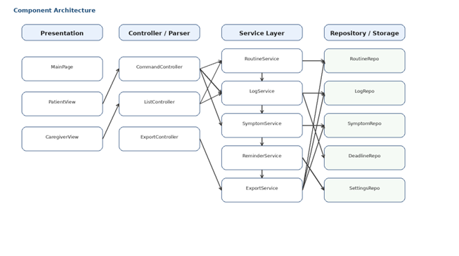
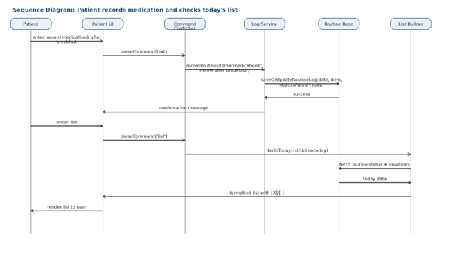

# System Architecture Diagrams
## Personal Health Routine Tracker (Desktop App, Non-Medical)

This document presents the architecture of the Personal Health Routine Tracker desktop application. It focuses on how the patient and caregiver views interact with the parser, service layer, storage, and export features. The system is intentionally local-first and non-medical.

- **Architecture style:** Layered desktop application with local persistence.
- **Primary input mode:** strict command-based text entry; no LLM or free-form interpretation.
- **Primary workflows:** record routine, skip routine, add symptom, add exercise, add note, add deadline, list today, export weekly summary.

---

## 1. High-Level System Architecture

At a high level, the application consists of a presentation layer, an application core, supporting services, and a local storage layer. The patient and caregiver both access the same desktop application, but their allowed actions differ.

**Figure 1.** High-level view of the desktop app, internal modules, and local storage.

---

## 2. Component Architecture

The component architecture separates UI classes, controllers/parsers, business services, and repositories. This separation keeps command handling testable and prevents UI code from directly manipulating persistence.

**Figure 2.** Component-level architecture with presentation, controller, service, and repository layers.

| Layer | Responsibilities |
|---|---|
| Presentation | Main page, patient view, caregiver view, command box, today list, weekly summary screen. |
| Controller / Parser | Receives raw user command, validates role, parses syntax, dispatches operation. |
| Service Layer | Implements routine, symptom, note, exercise, deadline, reminder, summary, and export logic. |
| Repository / Storage | Reads and writes local tables/files for settings, fixed routines, logs, symptoms, deadlines, and exports. |

---

## 3. Deployment Architecture

Because the product is a desktop application, deployment is intentionally simple: the app process, database/files, and exported reports all live on the user's own machine. Optional operating system notifications can be used for reminders.

**Figure 3.** Single-machine deployment architecture.

---

## 4. Interaction / Sequence Diagram

The sequence below shows a typical workflow in which a patient records a medication entry and then requests the list view for today's tasks.

**Figure 4.** Sequence for record + list workflow.

---

## 5. Important Workflows Explained

| Workflow | How it works |
|---|---|
| Record fixed routine | Patient enters a strict `record ...` command. Parser creates a `RecordCommand`. `RoutineService` saves or overwrites the same-day status and note. |
| Skip fixed routine | Patient enters `skip ...`. `RoutineService` stores skipped state and reason. List view later reflects the changed status. |
| Add symptom | Patient enters `symptom [description] [1-10]`. Parser extracts the final integer as severity and stores the full description plus score. |
| List today's tasks | `ListService` combines the fixed schedule with current completion state and today's deadlines, then formats `[X]` / `[ ]` markers for the UI. |
| Generate weekly summary | `SummaryService` aggregates the last seven days of records, symptom scores, daily notes, and exercise logs, then `ExportService` writes CSV or PDF. |

---

## 6. Design Decisions

- Local-first storage fits a simple desktop prototype and avoids server complexity.
- Strict command parsing is used because no LLM or natural language model is allowed in the system.
- Caregiver access is view-only so the first version stays simple and safer to reason about.
- Layered separation makes it easier to unit test parsing, validation, business rules, and export independently.
- Flexible deadline parsing improves usability while still normalizing all accepted formats into one internal time representation.