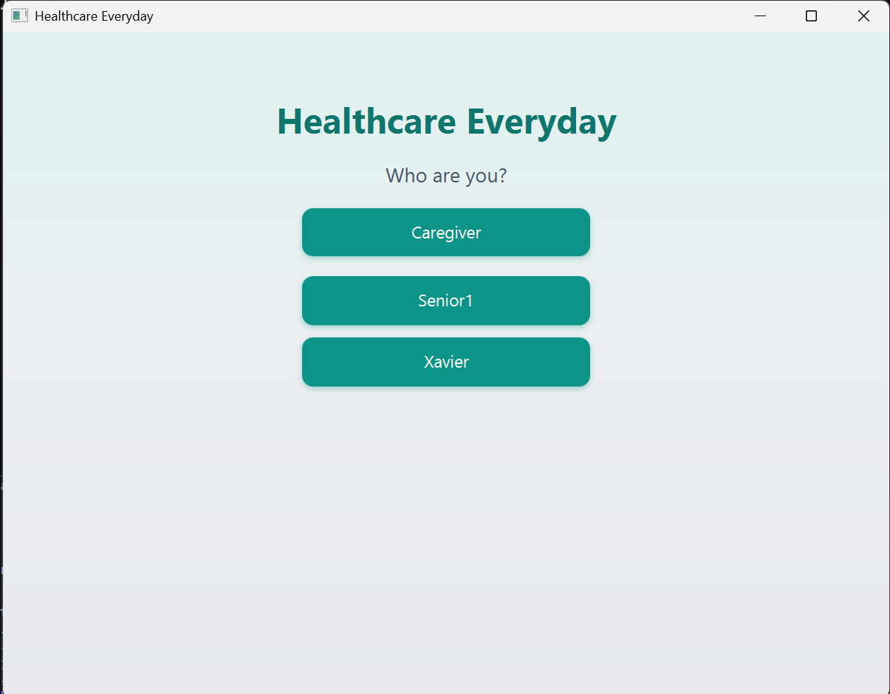
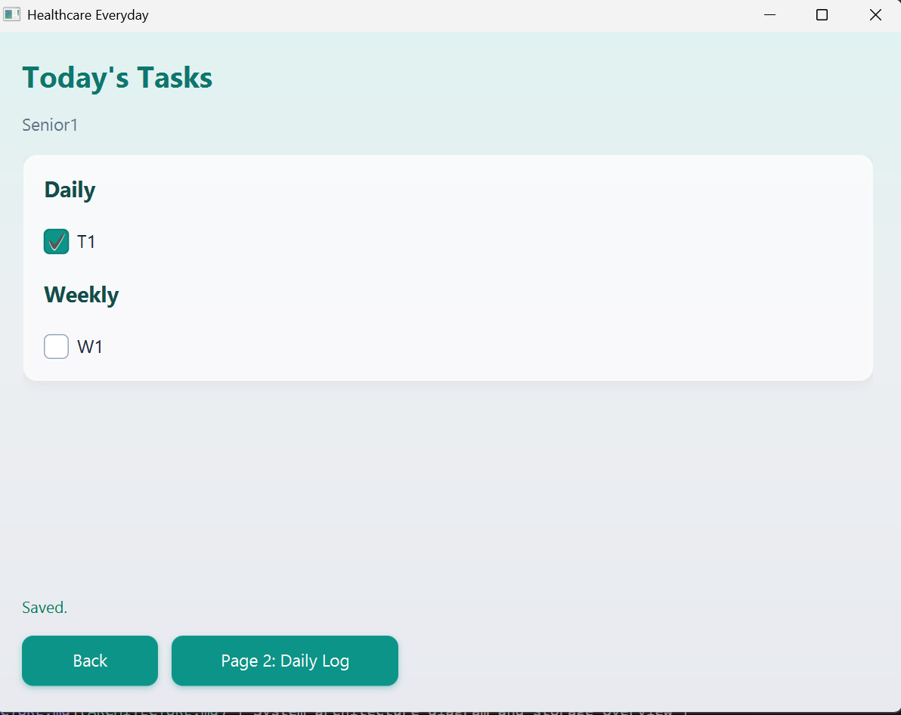
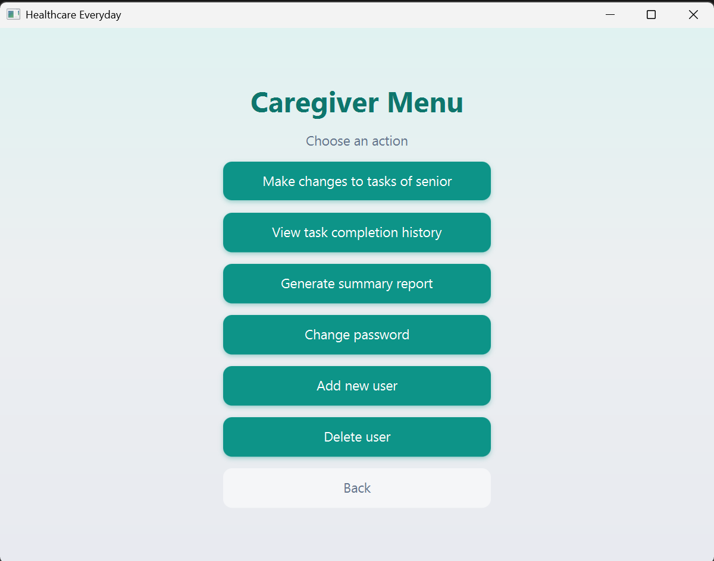

# User Guide — Healthcare Everyday

This guide explains how to use the Healthcare Everyday desktop app as a **Senior** and as a **Caregiver**.

---

## 1) Start and choose role

When the app opens, you will see the role/user selection screen:

- Click a senior name (for example, `Senior1`) to enter senior mode.
- Click `Caregiver` to enter caregiver login.

---

## 2) Senior user guide

After selecting a senior, you will see the **Today's Tasks** page:

### 2.1 Mark tasks as done

- Under **Daily**, tick each task completed today.
- Under **Weekly**, tick tasks completed this week.
- The status text `Saved.` confirms changes were stored.

### 2.2 Open daily log page

- Click `Page 2: Daily Log`.
- Type today’s notes (symptoms, mood, reminders, anything important).
- Click `Submit` to save the log for today.

### 2.3 Return to previous screen

- Click `Back` to return to the login/selection screen.

---

## 3) Caregiver user guide

After caregiver login, you will reach the menu:

### 3.1 Make changes to tasks of senior

- Choose `Make changes to tasks of senior`.
- Pick a senior.
- Add daily/weekly tasks, or remove existing tasks.
- Changes are saved immediately after add/remove actions.

### 3.2 View task completion history

- Choose `View task completion history`.
- Select:
  - **Today** to view all seniors and their current completion status.
  - **Past week** to select one senior and review a 7-day summary.

### 3.3 Generate summary report

- Choose `Generate summary report`.
- Select a senior.
- The app creates a monthly CSV report under `report/`.

### 3.4 Change caregiver password

- Choose `Change password`.
- Enter old password, then new password.
- Save to apply immediately.

### 3.5 Add new user

- Choose `Add new user`.
- Enter senior name.
- The app creates the new user profile and routine files.

### 3.6 Delete user

- Choose `Delete user`.
- Select the senior to remove.
- This deletes that user’s stored files.

---

## 4) Where data is saved

App data is stored locally:

- User data: `data/users/<senior>/`
- Caregiver password: `data/app/caregiver.txt`
- Generated reports: `report/*.csv`

---

## 5) Tips and troubleshooting

- If a save fails, try the action again and check file permissions.
- Keep senior names unique (duplicates are rejected).
- Empty task names are not allowed.
- If user lists do not load, verify the `data/` folder exists and is accessible.

